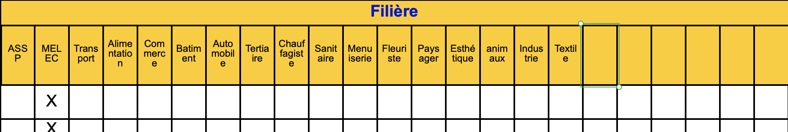

# stages-papa

Projet ayant pour objectif de projeter sur une carte les différents lieux des stages des élèves. Script convertissant le csv des adresses en csv lisible par google mymaps

## Déroulement
- Convertion du fichier xls dans le dossier `input` en un fichier csv : `data.csv`.
- Conversion du fichier `input.csv` en plusieurs csv `nom-filiere.csv`, lisible par google mymaps. On les retrouve dans le dossier `output`.
- Automatiser l'import des csv dans le dossier `output` dans google mymaps.

### Format des données
- Le tableau doit commencer à la première ligne et à la première colonne du tableur.
- La première ligne doit être la ligne d'entête, elle doit contenir les noms suivant : 'SOCIETE', 'ADRESSE', 'CP', 'VILLE', 'TEL', 'MAIL', 'FILIERE'. Toutes les autres colonnes seront ignorées.
- Les colonnes 'FILIERE' doivent suivre le format suivant : 
    
    C'est à dire que le mot 'FILIERE' doit être inscrit dans la première ligne du tableur et être fusionnée sur toutes les sous colonnes.

    Toutes les sous colonnes indiquant un nom de filiere doivent être sur le seconde ligne du tableur.Seules les colonnes sous le mot "filiere" seront importées. Les cases vides seront ignorées.
- À part pour les colonnes 'FILIERE', la seconde ligne sera ignorée.
- Pour inquer la filiere correspondante à la société, il faut que la case soit remplie avec n'importe quel caractère. Il est possible de mettre plusieurs filieres pour une société.
- Les données doivent être inscrites à partir de la troisième ligne.
- Ne rien inscrire sous le tableau ! Si il faut écrire du texte additionnel, les écrire à droite du tableau.